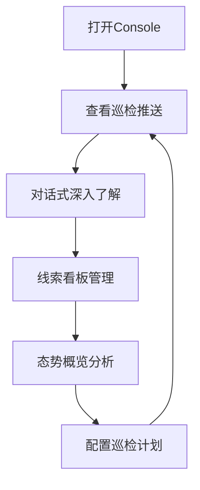

## 1. Product Overview
网络餐饮违规线索巡检智能体前端原型系统，基于QwenPaw二次开发模式构建，为检察院提供一站式网络餐饮安全监管解决方案。
- 核心目的：提升网络餐饮违规线索发现效率，降低人工巡检成本，提供证据保全和态势分析能力
- 目标用户：检察院检察官、食品安全监管人员

## 2. Core Features

### 2.1 User Roles
| Role | Registration Method | Core Permissions |
|------|---------------------|------------------|
| 检察官 | 内置账号登录 | 查看巡检结果、管理线索、生成文书、查看态势 |

### 2.2 Feature Module
1. **对话页面**: 实时对话、巡检结果卡片推送、主动通知
2. **线索看板**: 线索列表、多维度筛选、状态管理、批量操作
3. **态势概览**: 数据可视化、核心指标、趋势分析、区域分布
4. **巡检计划**: 定时任务配置、巡检参数设置
5. **设置页面**: 通知偏好、区域配置、数据源管理

### 2.3 Page Details
| Page Name | Module Name | Feature description |
|-----------|-------------|---------------------|
| 对话页面 | 对话流 | 支持自然语言对话，巡检结果以卡片形式嵌入对话流 |
| 对话页面 | 巡检结果卡片 | 结构化展示线索清单，支持风险等级筛选、查看详情、导出 |
| 线索看板 | 线索列表 | 展示所有线索，支持违法类型、风险等级、状态筛选 |
| 线索看板 | 线索详情 | 完整证据包、历史巡检记录、整改跟踪时间线 |
| 态势概览 | 核心指标 | 扫描商家数、发现线索数、高风险数、整改率 |
| 态势概览 | 图表展示 | 违规类型分布、风险趋势、高风险区域分布 |
| 巡检计划 | 任务管理 | 配置定时巡检任务、查看执行历史 |
| 设置页面 | 系统配置 | 通知偏好、区域配置、数据源管理 |

## 3. Core Process

检察官打开浏览器访问Console → 查看推送的巡检结果 → 在对话中深入了解线索详情 → 在线索看板管理线索状态 → 通过态势概览掌握全局情况 → 配置巡检计划持续监管。

## 4. User Interface Design

### 4.1 Design Style
- **Primary colors**: 深蓝 (#1e40af) 作为主色调，代表专业和可靠；红色 (#dc2626) 表示高风险，橙色 (#f59e0b) 表示中风险，绿色 (#10b981) 表示低风险
- **Secondary colors**: 浅灰 (#f3f4f6) 背景，中灰 (#6b7280) 文字
- **Button style**: 圆角矩形，有hover和active状态变化
- **Font**: 使用 Inter 字体，标题字重600，正文400
- **Layout style**: 侧边栏导航 + 主内容区的卡片式布局
- **Icon**: 使用 Lucide React 图标库，简约现代风格

### 4.2 Page Design Overview
| Page Name | Module Name | UI Elements |
|-----------|-------------|-------------|
| 对话页面 | 对话流 | 聊天气泡样式，左侧智能体，右侧用户，支持滚动 |
| 对话页面 | 巡检卡片 | 渐变边框卡片，风险等级用颜色区分，可展开详情 |
| 线索看板 | 列表表格 | 清晰的列布局，状态标签色彩鲜明，支持筛选 |
| 态势概览 | 指标卡片 | 数字突出显示，环比变化用箭头指示 |
| 态势概览 | 图表区 | 响应式图表，支持缩放和交互 |
| 侧边栏 | 导航菜单 | 垂直导航，激活状态高亮 |

### 4.3 Responsiveness
- 桌面端优先设计，适配1024px及以上屏幕
- 平板和移动端进行响应式适配，导航转为抽屉式
- 表格和图表在小屏幕上支持水平滚动

### 4.4 Interaction Design
- 卡片悬停有阴影和轻微上浮效果
- 按钮点击有按压反馈
- 页面切换有平滑过渡动画
- 关键数据有加载骨架屏
